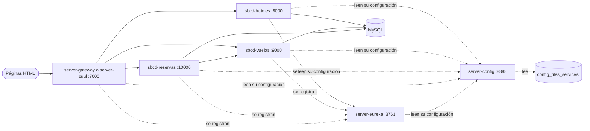

# Microservicios con Spring Boot y Spring Cloud

Proyecto de curso para practicar una arquitectura de microservicios con **Spring Boot 2.6** y **Spring Cloud**: una aplicación de reservas de viajes (vuelos, hoteles y reservas) con descubrimiento de servicios, configuración centralizada y puerta de enlace.

> **Estado: proyecto de aprendizaje, sin terminar.** Faltan la seguridad, el despliegue en contenedores y el patrón Circuit Breaker.

## Arquitectura



## Módulos

| Módulo | Qué hace |
|---|---|
| `server-config` | Configuración centralizada. Lee la carpeta [`config_files_services`](config_files_services) de este repositorio. |
| `server-eureka` | Registro y descubrimiento de servicios. |
| `server-gateway` | Puerta de enlace con Spring Cloud Gateway. |
| `server-zuul` | La misma puerta de enlace con Zuul (versión anterior del ejercicio). |
| `sbcd-hoteles` | API de hoteles disponibles. |
| `sbcd-vuelos` | API de vuelos, con actualización de plazas. |
| `sbcd-reservas` | API de reservas; al reservar actualiza las plazas en el servicio de vuelos. |
| `sbdc-contact` | Ejercicio aparte: CRUD de contactos y ejemplo de métodos asíncronos. |
| `sbcd-client-contac` | Cliente que consume la API de contactos con `RestTemplate`. |

`webViajesContent` y `client-contact` contienen páginas HTML sueltas para probar las APIs.

## Cómo ejecutar

Requiere Java 11, Maven y MySQL con las bases `viajes` y `sbcd`. Cada módulo se arranca desde su carpeta con `mvn spring-boot:run`, en este orden:

1. `server-config`
2. `server-eureka`
3. `sbcd-hoteles`, `sbcd-vuelos` y `sbcd-reservas`
4. `server-gateway`

A través de la puerta de enlace (`http://localhost:7000`), las APIs quedan en `/shoteles/**`, `/svuelos/**` y `/sreservas/**`.

## Variables de entorno

| Variable | Para qué sirve |
|---|---|
| `CONFIG_GIT_URI` | Repositorio git con la configuración. Por defecto, este repo. |
| `DB_USERNAME` y `DB_PASSWORD` | Credenciales de MySQL. Tienen un valor por defecto solo para desarrollo local. |

## Tests

Cada módulo tiene un test de arranque:

```bash
cd sbcd-hoteles
mvn test
```

No necesitan MySQL, Eureka ni el Config Server: usan H2 en memoria.

## Temas del curso

- Desarrollo de microservicios e interacción entre ellos
- Configuración centralizada
- Registro y descubrimiento
- Puerta de enlace (Zuul y Spring Cloud Gateway)
- Pendientes: seguridad, despliegue en contenedores Docker, Swagger y Circuit Breaker
